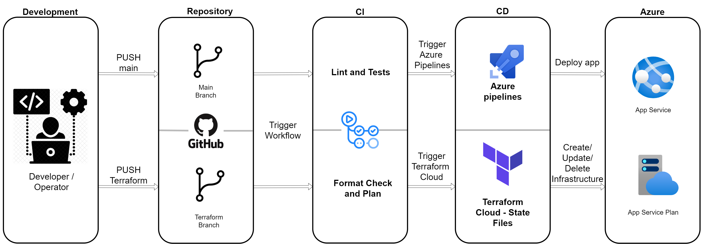

[](https://dev.azure.com/ronnaldmachado0697/Agile_ML_Engineer/_build/latest?definitionId=3&branchName=main)
# Overview

A data science team built a model using scikit learn and exported a [joblib file](https://scikit-learn.org/stable/modules/model_persistence.html). They wish to share this functions with all company throught an API.

In this project I implemented a Microservice strategy using flask and Azure web app to delivery the solution.

Desgined to be the single source of thruth this repo has the code of the application and the code to build the infrastructure.

For application I implemented a full CI/CD cycle using Github Actions (CI) and Azure Devops (CD). 

For infrastructure provisioning, I use terraform. A full CI/CD cycle was implemented using Github Actions(CI) and Terraform Cloud(CD).

The application code are in the main branch and the terraform code in the terraform branch.




## Project Plan
<TODO: Project Plan

* A link to a Trello board for the project
* A link to a spreadsheet that includes the original and final project plan>

## Instructions


<TODO:  Instructions for running the Python project.  How could a user with no context run this project without asking you for any help.  Include screenshots with explicit steps to create that work. Be sure to at least include the following screenshots:

* Project running on Azure App Service

* Project cloned into Azure Cloud Shell

* Passing tests that are displayed after running the `make all` command from the `Makefile`

* Output of a test run

* Successful deploy of the project in Azure Pipelines.  [official documentation should be referred to and double checked as you setup CI/CD](https://docs.microsoft.com/en-us/azure/devops/pipelines/ecosystems/python-webapp?view=azure-devops).

* Running Azure App Service from Azure Pipelines automatic deployment

* Successful prediction from deployed flask app in Azure Cloud Shell. 
The output should look similar to this:

```bash
ronnald@Azure:~$ ./make_predict_azure_app.sh
Port: 443
{"prediction":[20.35373177134412]}
```

* Output of streamed log files from deployed application

> 

## Enhancements

<TODO: A short description of how to improve the project in the future>
Also I created a virtualization branch with scaffolding to running the application on docker or kubernets.

## Demo 

<TODO: Add link Screencast on YouTube>